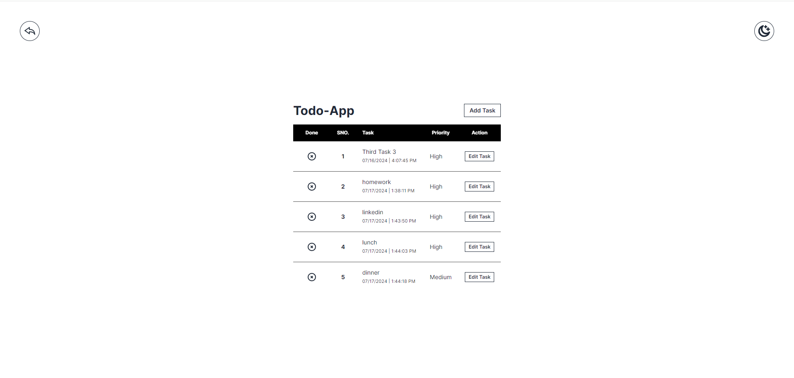
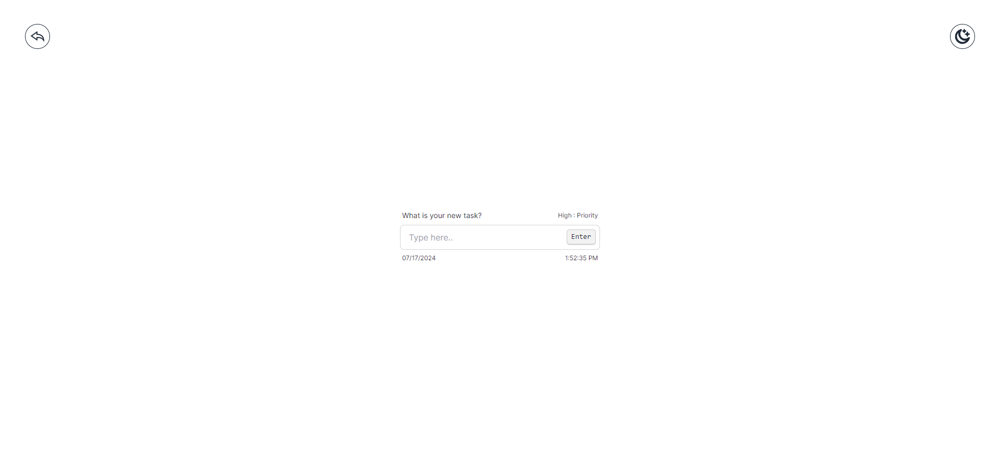

# NxTodo App

## [Visit Website Here..](https://nxtodo.vercel.app)





A simple and intuitive to-do list app built with Next.js, MongoDB, and DaisyUI. This app allows you to manage your tasks efficiently, keeping you organized and productive. Stay organized and boost productivity with our intuitive to-do list app. Manage your tasks effortlessly with features like easy task addition, categorization, and synchronization across devices. Perfect for both personal and professional use, our user-friendly interface ensures you stay on top of your to-do list. Add, edit, and delete tasks with ease, and enjoy the satisfaction of checking off completed items.

**Features:**

- **Task Management**: Add, edit, and delete tasks with ease.
- **Task Completion**: Mark tasks as completed.
- **Responsive Design**: Optimized for all devices.
- **Real-time Updates**: Tasks are updated in real-time using MongoDB.

**Tech Stack:**

- **Next.js**: A React framework for building server-side rendered and static web applications.
- **MongoDB**: A NoSQL database for storing tasks.
- **DaisyUI**: A Tailwind CSS component library for styling the app.

**Installation:**

1. **Clone the repository:**

   ```bash
   git clone https://github.com/ABHISHEK-SIN-GH/next-todo.git
   cd todo-app
   ```

2. **Install dependencies:**

   ```bash
   npm install
   ```

3. **Set up environment variables:**
   Create a `.env.local` file in the root directory and add the following:

   ```env
   MONGODB_URI=your_mongodb_uri
   NEXTAUTH_URL=http://localhost:3000
   ```

4. **Run the development server:**

   ```bash
   npm run dev
   ```

   Open [http://localhost:3000](http://localhost:3000) with your browser to see the result.

**Project Structure:**

- `components/`: Contains reusable React components.
- `api/`: Contains Next.js API routes.
- `lib/`: Contains utility functions, such as database connection.

**Contributing:**

1. Fork the repository.
2. Create a new branch (`git checkout -b feature-branch`).
3. Make your changes.
4. Commit your changes (`git commit -am 'Add new feature'`).
5. Push to the branch (`git push origin feature-branch`).
6. Create a new Pull Request.

**License:**
This project is licensed under the MIT License.

**Contact:**
For any questions or suggestions, feel free to contact me at [singh.abhishek151019@gmail.com](mailto:singh.abhishek151019@gmail.com).

---

Made with ❤️ by [Abhishek Singh](https://github.com/ABHISHEK-SIN-GH)
